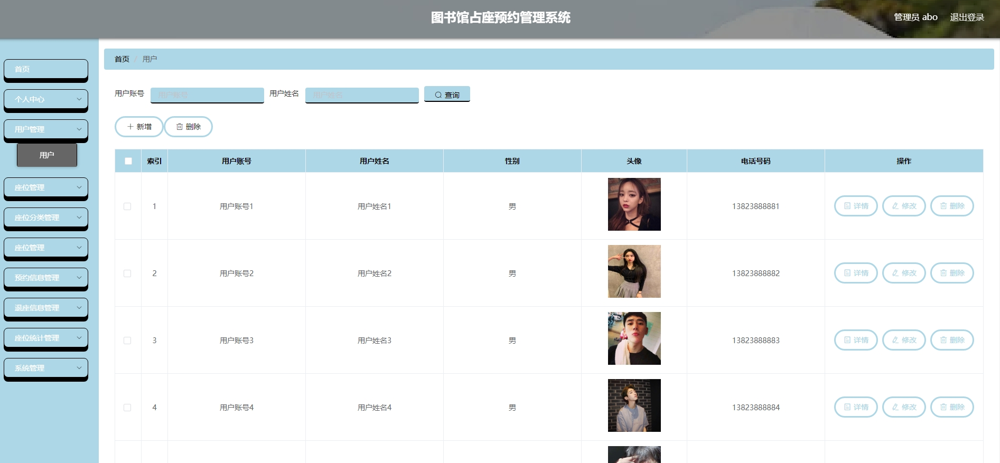
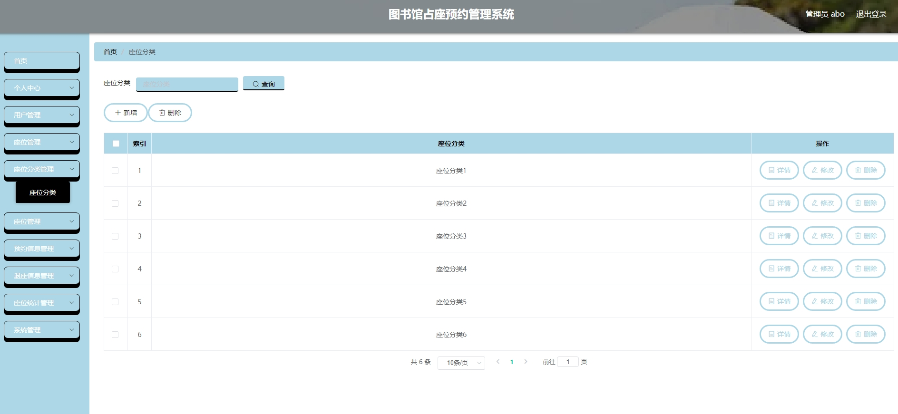
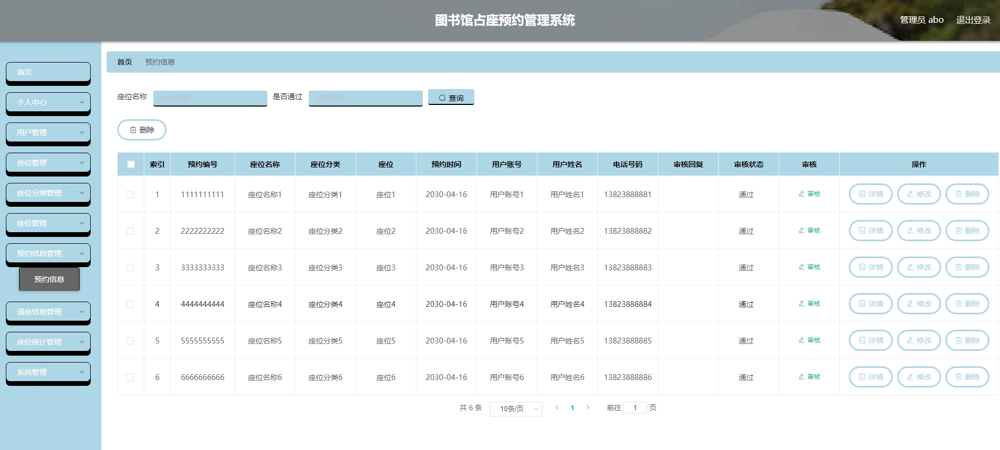
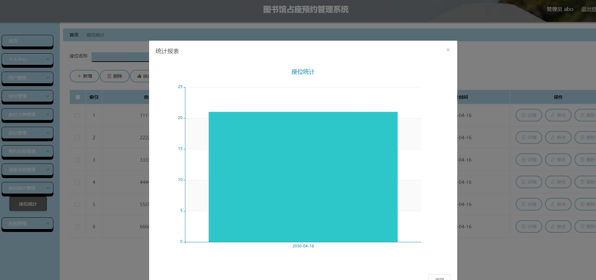
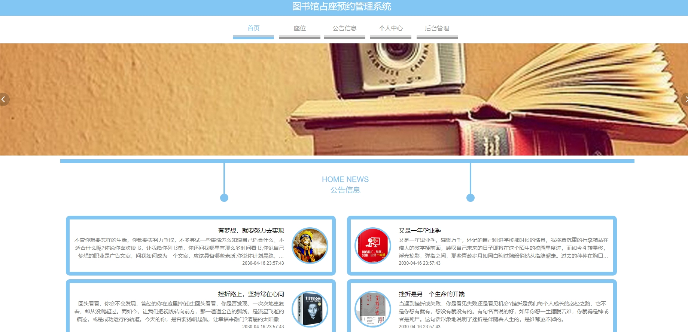
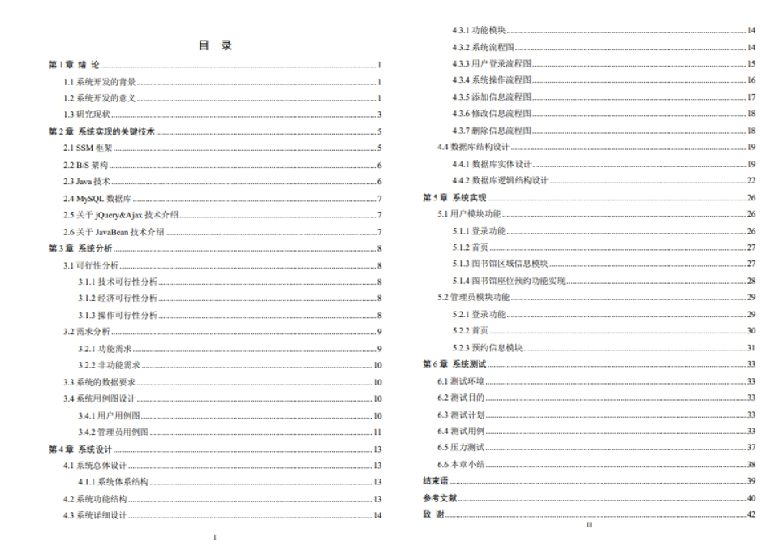

#1.项目介绍
- 系统角色：管理员、普通用户
- 功能模块：管理员（用户管理、座位管理、座位分类管理、图书馆管理、预约信息管理、退座管理、系统管理等）、普通用户（信息查看、图书馆管理、个人中心、座位预约等）
- 技术栈：SSM， vue等
- 测试环境：idea2024，jdk1.8，mysql5.7，maven3，tomcat8
# 2.项目部署
- 创建数据库，导入sql
- 通过idea打开项目，根据本地数据库环境配置src/main/resources/config.properties  3-5行 ，非常重要哦~
- 配置tomcat
- 启动项目
- 后台管理web：http://localhost:8080/ssmzg09h/admin/dist/index.html  管理员账号密码:abo/abo
- 前端:http://localhost:8080/ssmzg09h/front/index.html,普通账户自行查看表
# 3.项目部分截图

# 4.获取方式
[戳我查看](https://gitee.com/aven999/mall)